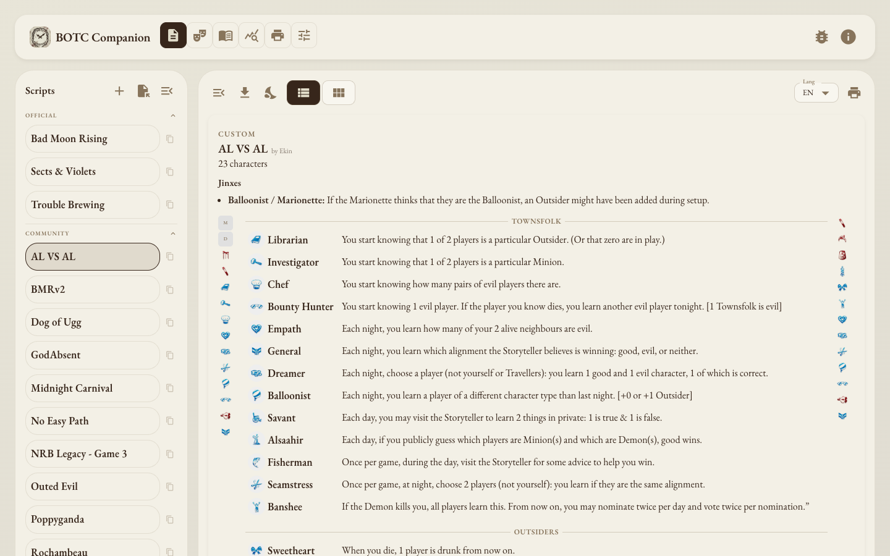
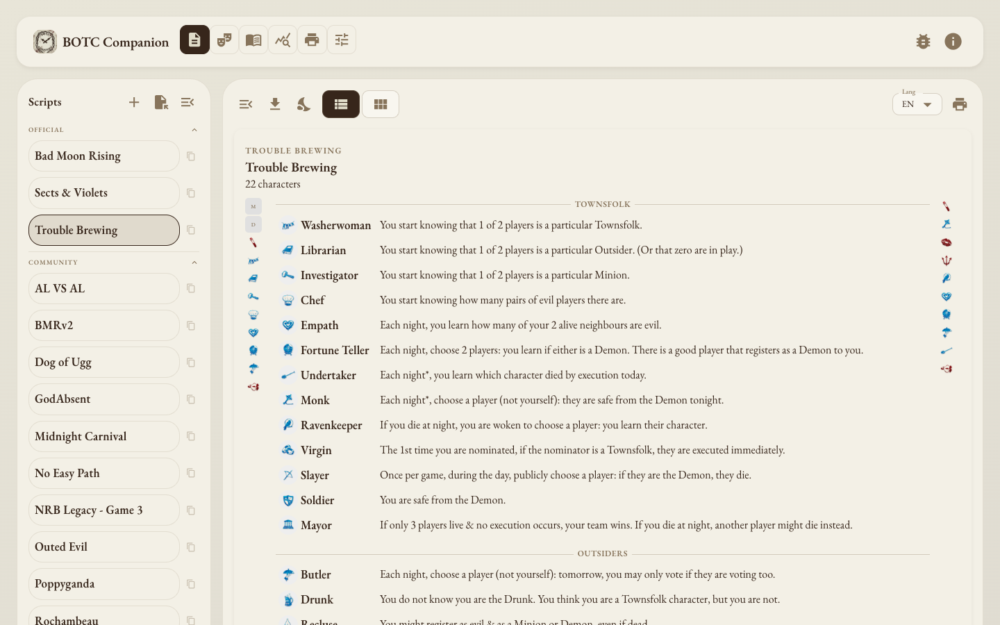
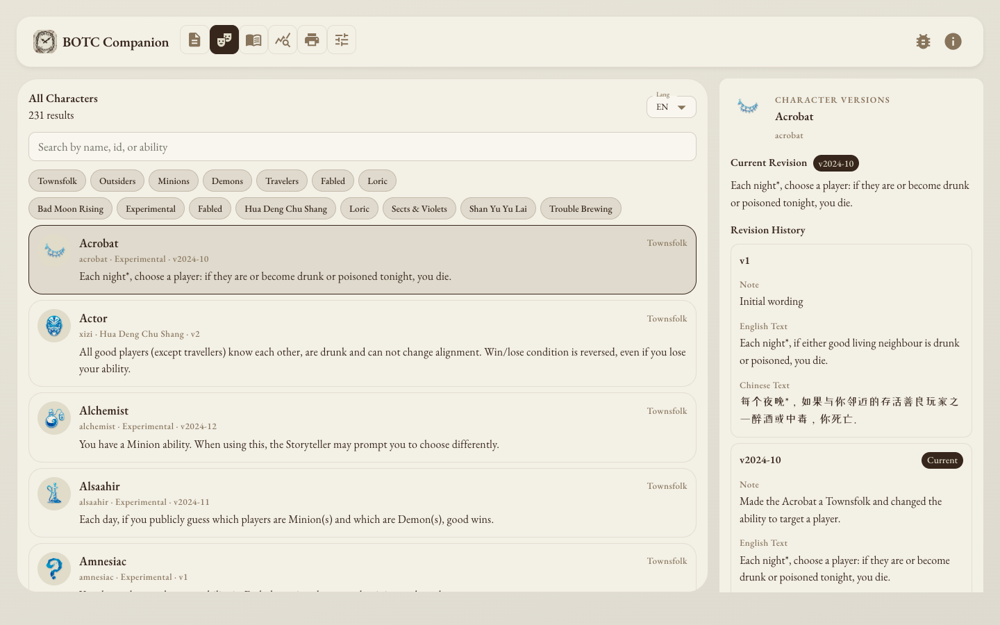
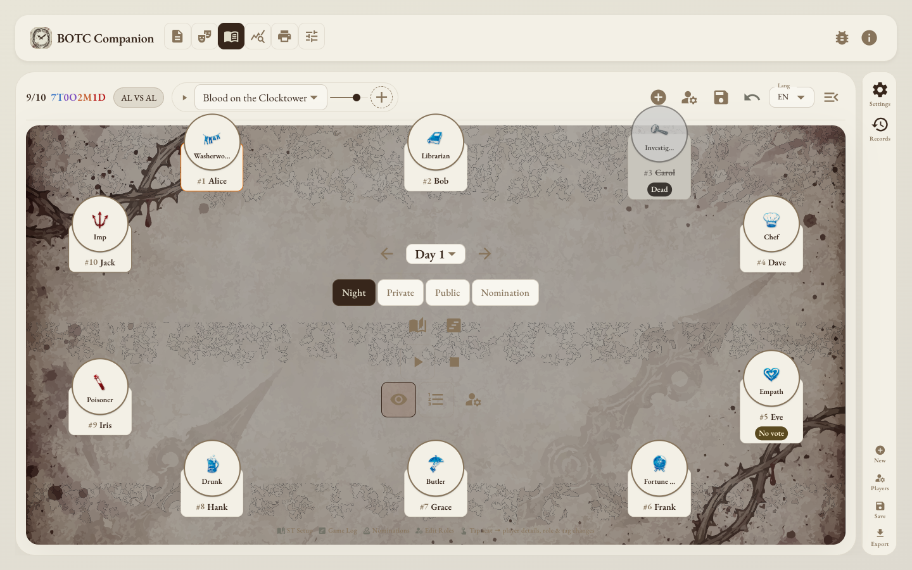
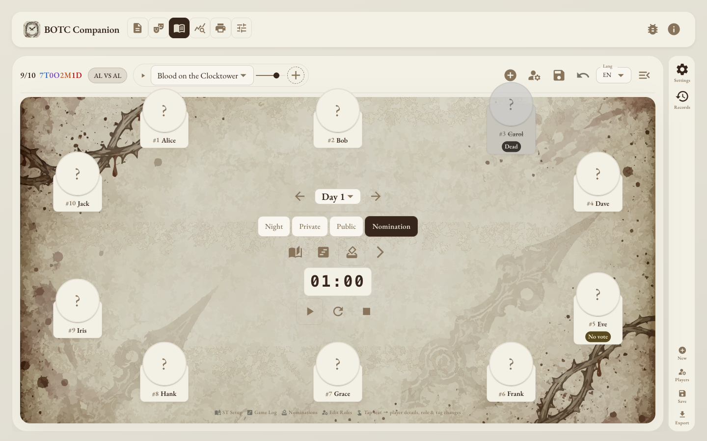
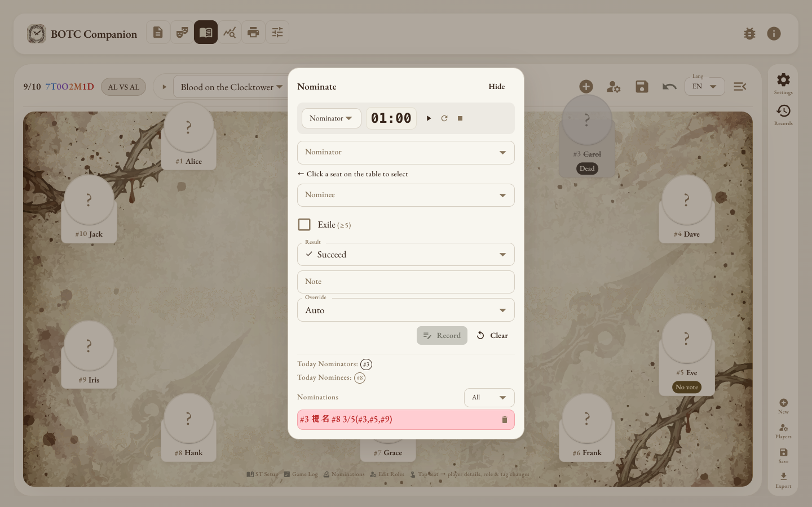
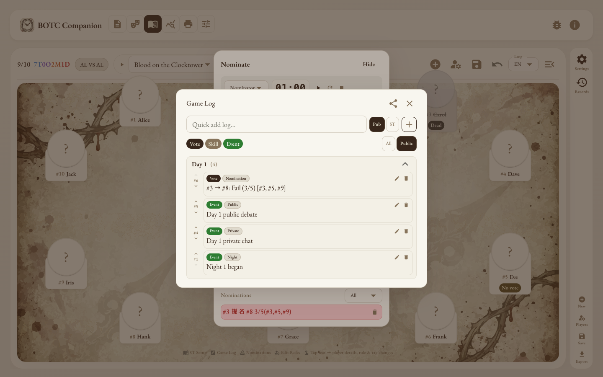
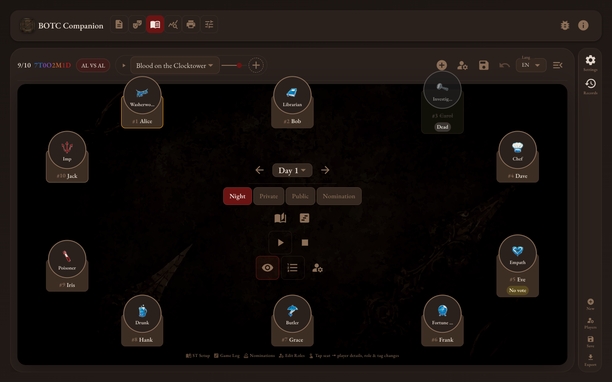
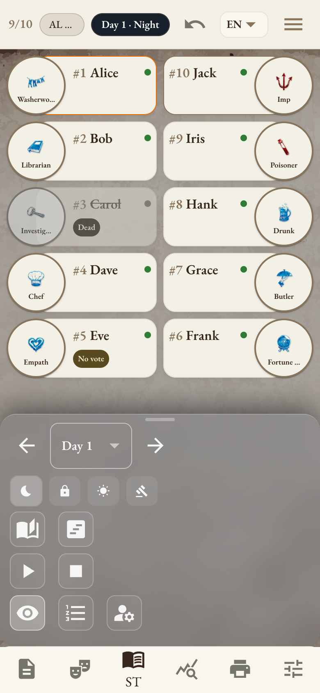
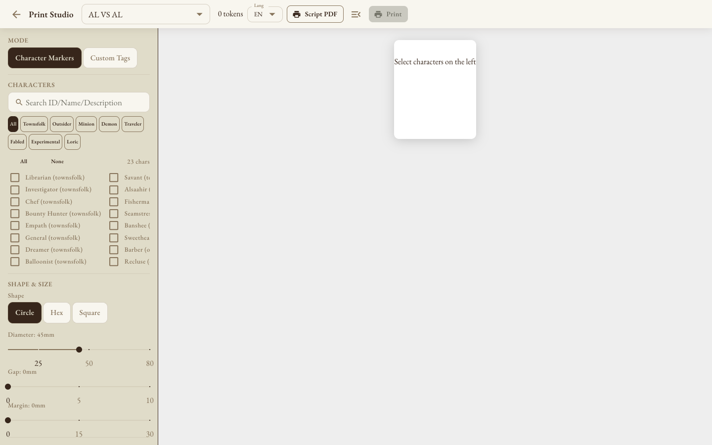

# BOTC Companion

A storyteller tool for **Blood on the Clocktower** — browse scripts, run games, track votes and skills, and print character tokens.

**[▶ Open the app](https://xpandi-top.github.io/botc-script-editor/)**

---

## Features at a glance

| Tab | What it does |
|-----|-------------|
| **Scripts** | Browse official + community scripts, upload custom JSON, export to PDF |
| **Characters** | Full character library with abilities, jinxes, EN/ZH text |
| **Storyteller** | Run a live game — phases, timers, nominations, votes, skill log |
| **Analytics** | Save game records, view win-rate and character frequency charts |
| **Print Studio** | Generate printable character token sheets |

---

## Scripts

Browse and select scripts. Click any script to see the full character list with abilities.



Click a script to expand the character sheet with EN/ZH ability text:



---

## Characters

Browse all characters across editions. Filter by team, edition, or search by name. Click any character for full ability text, jinxes, and revision history.



---

## Storyteller — running a game

### Night phase

Seat circle shows all players with character icons and ST tags. Use the phase controls (Night / Private / Public / Nomination) and built-in timer to pace the game.



Click any seat circle to open the player modal — assign characters, record night skills, mark dead/no-vote, add ST tags.

### Nomination phase

Switch to Nomination to reveal the vote timer and nomination sheet.



Open the nomination sheet to record nominator, nominee, voters, and pass/fail result:



### Game Log

All votes, skills, and events are logged automatically. Filter by type (Vote / Skill / Event) and visibility (Public / ST-only). Share the public log with players at the end of the game.



### Dark theme

Full dark mode available in Settings:



---

## Mobile

Fully responsive — the seat circle becomes a grid on small screens. Bottom navigation replaces the tab bar.



---

## Print Studio

Select characters, choose shape (circle / hex / square) and size, then print or save as PDF for physical token sheets.



---

## Local setup

```bash
npm install
npm run dev        # dev server at http://localhost:5173
npm run build      # production build → dist/
npm test           # run unit tests (Vitest)
```

---

## Upload a custom script

1. Open the **Scripts** tab
2. Click **Upload JSON**
3. Select a standard BotC script JSON file
4. The script appears in the **DIY** section and is immediately usable in the Storyteller

---

## Add a character ability revision

```bash
npm run add-revision -- <character_id> --en "English text" --zh "Chinese text"
```

Updates `assets/characters/*.json` and both locale files. Run `npm run build` after to validate.

---

## Deploy to GitHub Pages

The app builds as a static site. `vite.config.ts` sets `base: '/botc_webapp/'` to match the repo name.

```bash
npm run build       # outputs to dist/
# push dist/ to gh-pages branch, or use the Actions workflow
```

If the repository name changes, update `base` in `vite.config.ts`.
