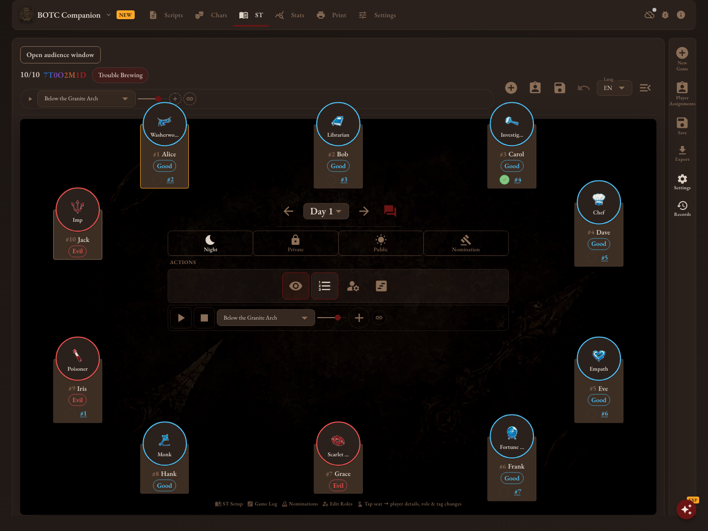
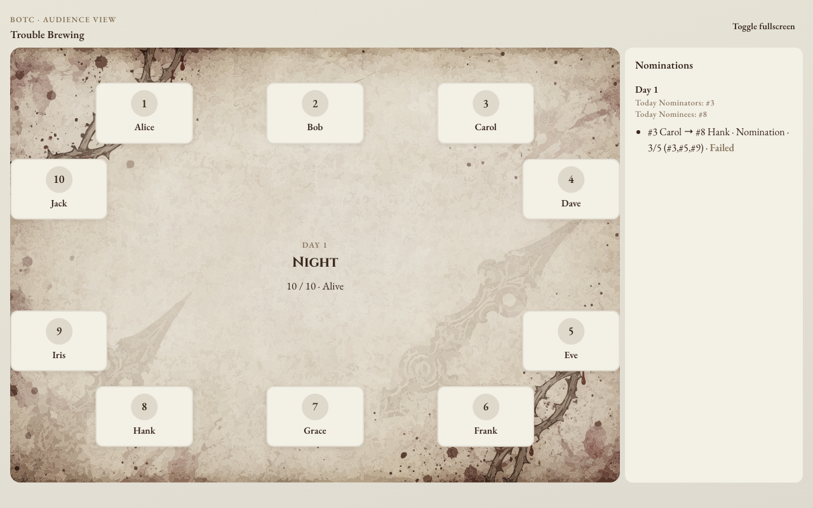
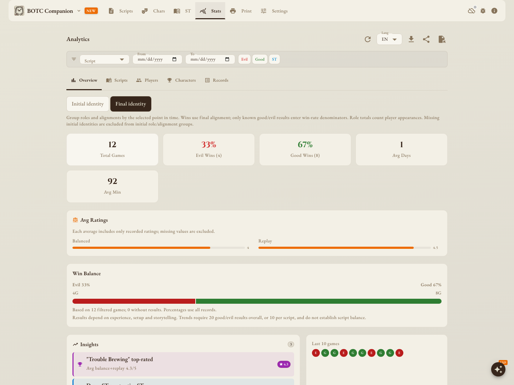
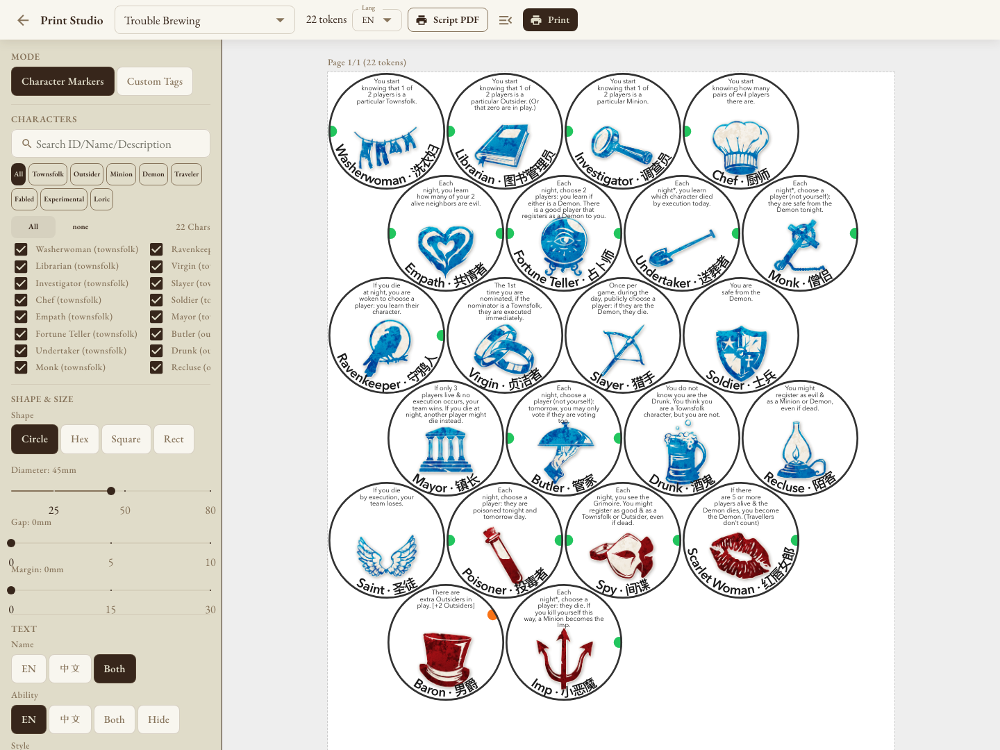
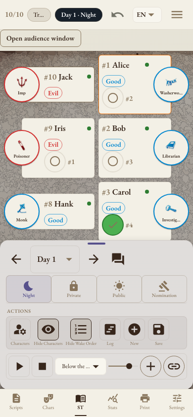

<div align="center">


# BOTC Companion

### 主持更省心，故事更精彩。

为《血染钟楼》说书人打造的主持助手。<br />
从开局准备到现场主持，再到赛后复盘，帮你把一场游戏安排妥当。

**[立即体验 →](https://apps.xpandi.top/botc-script-editor/)** · **[下载桌面版 / 安卓版](https://github.com/xpandi-top/botc-script-editor/releases)** · **[操作手册](docs/USER-GUIDE.md)** · **[查看更新](docs/CHANGELOG.md)**

中文 / English · 电脑和手机均可使用 · 浅色 / 深色主题 · 支持安装到桌面



*实际界面截图 · 本页对局记录、胜率和评分均为虚构演示数据*

</div>

## 主持需要的工具，都在手边

| 开局准备 | 现场主持 | 赛后复盘 |
| :--- | :--- | :--- |
| 选剧本、查角色、分配身份 | 跟进夜序、控制时间、记录提名和投票 | 保存进度、回看记录、查看统计 |

## 主持信息自己看，公开画面放心投

独立的**观众窗口**只展示公开信息。说书人照常查看身份、标记和夜间记录，玩家看到的则是座位状态、倒计时与提名结果。线下投到大屏，线上单独共享窗口，都方便。



## 排好角色，玩家扫码领取身份

集中安排角色和恶魔伪装，支持随机分配与开局配置提醒。玩家可以扫码入座、领取身份，说书人也能发送私信或群发通知，让开局少一些来回确认。

<table>
<tr>
<th width="33%">选择座位</th>
<th width="33%">查看身份</th>
<th width="33%">点击投票 · 实验功能</th>
</tr>
<tr>
<td></td>
<td></td>
<td></td>
</tr>
</table>

玩家选座、领取身份；提名时，还可以尝试直接用手机投票。[查看操作图解](docs/USER-GUIDE.md#assignments)

*以上为真实界面配合本地模拟会话的演示截图。正式使用需要联网；联动投票仍属实验功能，欢迎试用反馈。*

## 找剧本、查角色，准备起来更方便

浏览内置与社区剧本，导入自己的剧本，查阅中英文角色资料和相克规则。无论是熟悉的官方剧本，还是自定义角色，都能放在同一个剧本库里管理。

## 每场都有记录，复盘有据可查

提名、行动和事件随时可查。按剧本、玩家或角色回看对局，比较胜负、时长与评分，为下一次组局积累经验。



## 自己做角色标记，打印就能上桌

**打印工坊**支持多种形状和中英文内容。选好角色、调整样式，就能打印或导出 PDF，准备线下游戏所需的角色标记。



<table>
<tr>
<td width="34%" align="center"></td>
<td>

### 按自己的习惯来

电脑和手机都能用。语言、浅色与深色主题、字体、界面大小都可以调整，让桌边操作更顺手。

对局数据保存在本机，已缓存的内容可以离线使用。备份、恢复与云同步的说明见[操作手册](docs/USER-GUIDE.md#settings)。

**[在浏览器中开始一局 →](https://apps.xpandi.top/botc-script-editor/)**

</td>
</tr>
</table>

## 实验功能 · 欢迎试用反馈

**AI 聊天助手（Experimental）** 已开放试用，可以尝试用它查询角色、询问规则或检查剧本。回答质量和交互仍在调整，暂不作为正式裁定依据。

**手机联动投票（Experimental）** 也已开放试用，轮到自己时可在手机上点击「赞同」或「反对」。[查看投票图解](docs/USER-GUIDE.md#player-voting)

欢迎告诉我们哪里回答不准、哪里用起来不顺手。[查看试用方法](docs/USER-GUIDE.md#ai) · [提交反馈](https://github.com/xpandi-top/botc-script-editor/issues)

## 第一次使用？

先选剧本，再到「主持助手」创建游戏、安排角色，就可以开始了。具体步骤、功能说明和常用设置都整理在[操作手册](docs/USER-GUIDE.md)中。

<details>
<summary><strong>本地运行与项目文档</strong></summary>

```bash
npm ci
npm run dev
```

- [开发、构建与部署](docs/DEVELOPMENT.md) · [测试说明](docs/TESTING.md)
- [演示数据与自动截图](docs/PRODUCT-DEMO.md) · [更新日志](docs/CHANGELOG.md)
- [观众窗口](docs/PRESENTER-MODE.md) · [数据存储](docs/STORAGE.md)
- [社区内容](docs/COMMUNITY-CONTENT.md) · [奥德赛角色包](docs/ODYSSEY.md)

</details>

---

<div align="center">

**少为流程分心，多享受说书的乐趣。**

由社区开发的《Blood on the Clocktower / 血染钟楼》辅助工具，非官方产品。<br />
游戏名称、角色与相关素材的权利归各自权利人所有。

[打开应用](https://apps.xpandi.top/botc-script-editor/) · [反馈问题](https://github.com/xpandi-top/botc-script-editor/issues)

</div>
