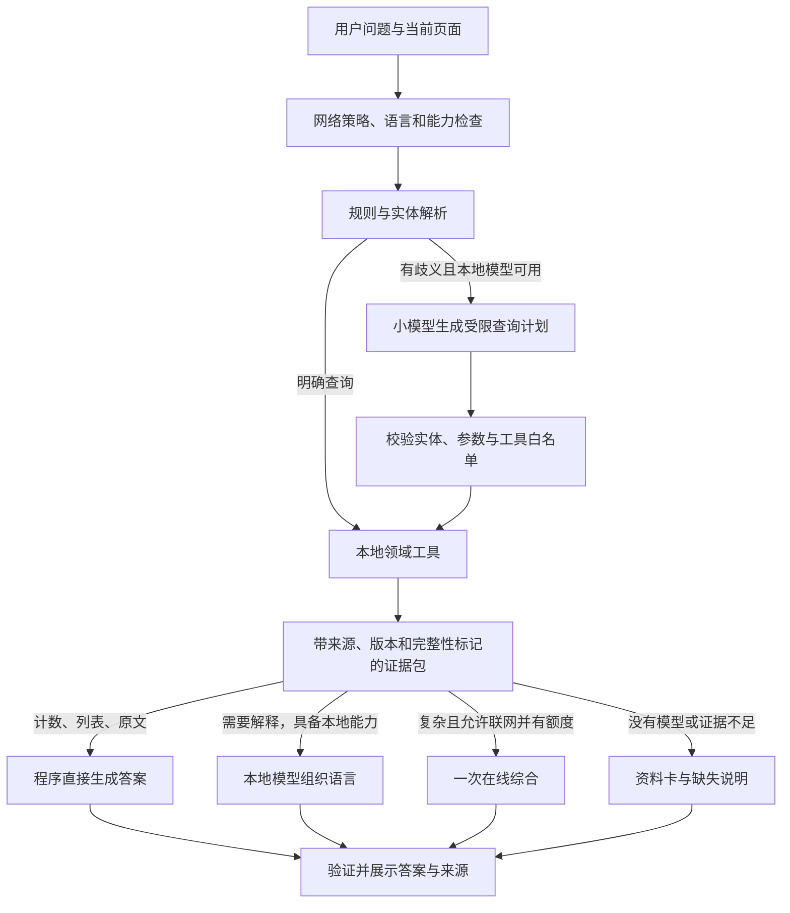
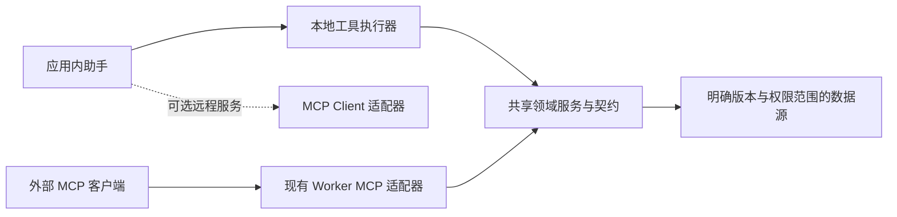

# BOTC AI：离线优先架构评审与实施计划

日期：2026-09-23。状态：设计提案，尚未实施本轮重构。

本评审基于当前工作区，包括前两轮尚未提交的 Groq、上下文预算和奥德赛检索修复。下面的接口、预算、验收门槛均为建议，不能视为已经实现或测得的性能。

## 1. 建议决策

把现有“选一个在线模型，然后拼接提示词”的模式改为：**本地事实工具 → 有界查询计划 → 证据包 → 确定性回答 / 本地模型 / 可选在线模型 → 校验与呈现**。

程序负责计数、角色名单、能力原文、版本、投票计算、夜序和脚本结构校验。模型负责自然语言理解、解释、翻译草稿与综合分析。在线能力可以完全缺席；本地生成模型也可以缺席，此时仍可完成数据查询与规则原文查阅。

建议保留 Qwen 作为已配置用户的在线默认选择，但取消“所有任务默认发给它”的路由方式。新用户默认进入“本地优先，在线未启用”，已有在线配置迁移后保留原有授权范围；增加“严格离线”和“仅使用指定模型”的明确选项。

## 2. 当前实现的具体问题

| 优先级 | 已确认的实现 | 影响 | 建议 |
|---|---|---|---|
| P0 | `src/lib/ai/prompts.ts:118/202` 把普通处决票数门槛写成“超过半数”，并把核心规则标为高优先级 | 即使检索、模型都正常，也可能被错误参考资料引导 | 核对规则来源，移除未审核的高优先级规则摘要；程序计算与版本化规则测试共同约束 |
| P0 | `src/lib/aiSettings.ts:93` 每次读取都让环境 provider 覆盖用户选择，迁移也会重置 provider | UI 切换后可能重新使用旧服务商；环境 key 也覆盖用户输入 | 明确配置优先级：会话选择 > 用户配置 > 安装默认；环境变量只用于默认值，不能反复改写用户配置 |
| P0 | `src/components/AiPanel/ChatTab.tsx:289` 无 key 禁用发送；`isAiAvailable` 也只判断 key | 本地查询和本地模型无法独立使用 | 用任务能力状态代替 `hasApiKey`；按钮、Enter、技能快捷入口使用同一检查 |
| P0 | `worker/src/mcp.ts:87–92` 搜索默认 limit=20、上限100，返回 `count: items.length` | 119 个角色可能呈现为20条结果；工具缺少总数与下一页语义 | 增加总数、分页及独立 aggregate 工具。**这是一条潜在错误路径，并非声称前次聊天调用过 MCP** |
| P0 | 在线 key 经 `VITE_*` 读取并用于浏览器请求，且 localStorage 保存 key | 环境 key 会进入构建客户端；“只存在 localStorage”的 UI 说明不准确 | 发布构建禁止打包 AI 私密 key；个人 BYOK 可选择本次会话保存；托管服务 key 留在受控服务端。Electron 使用系统凭据存储 |
| P1 | `src/lib/gemini.ts` 实际包装三个在线服务，未抽象本地运行时 | key、协议、模型能力、可用性耦合 | 引入 RuntimeAdapter 和 ModelRegistry；旧接口先作为兼容层 |
| P1 | Groq 采用5500估算上限，但没有累计额度账本、响应 usage、限流状态 | 单次缩小后，连续请求仍可能被拒；无法解释实际消耗 | 统一请求预算和账户限流状态，保留模型真实 usage、重置时间、请求取消 |
| P1 | `src/lib/ai/api.ts:40` 将 JSON 直接断言为 AgentResponse，其他分支靠正则补救 | JSON 合法不代表字段、类型、可写目标正确 | 输出 schema 校验；无法验证的 fills 不应用；普通聊天不强制使用填表 JSON |
| P1 | 目录检索、Wiki TF-IDF、角色 TF-IDF、Gemini 向量检索并存 | 来源、查询意图、筛选和预算规则不一致 | 统一 QueryPlan、EvidenceBundle 和来源版本接口 |
| P1 | 新目录查询基于模块初始化时的 `allCharacterFiles`；应用另有自定义角色注册表与覆盖版本 | 名称/能力可能反映覆盖值，但集合成员、版本归属和统计范围并不统一 | 建立有效目录快照：内置数据 + 上传包 + 自定义角色 + 当前/锁定版本，并记录 revision |
| P1 | `src/lib/botcSearch.ts:105` 主要索引英文能力，按空格分词；查询向量仍需 Gemini | 中文召回弱；预生成向量不等于运行时离线向量检索 | 双语词法索引先补齐；可选本地 multilingual embedding，统一文档与 query 的模型和处理参数 |
| P1 | PWA 预缓存规则未包含通用 JSON，runtimeCaching 只覆盖部分资源 | Wiki/embeddings 等首次使用未必能在断网下取得 | 明确“离线资料包”安装、完整性、版本、缓存状态，实际断网启动验收 |
| P1 | 前端聊天不执行现有 MCP 工具；Worker 工具已复用部分 core，但很多包装与环境绑定 | 同一事实/校验功能出现不同实现和行为 | 先提取共享领域服务和工具契约，再提供本地与 MCP 两种入口 |
| P2 | 通用、规则、翻译、创作任务复用长提示词和同类生成参数 | 简单任务的 token、延迟和格式错误成本过高 | 按任务使用短提示模板与能力选项，运行时不支持的参数不传 |

官方术语表对普通处决要求是至少半数存活玩家的票，并高于其他被提名者的票数。因此“6人存活，3票达到门槛”应进入回归测试；角色特殊规则另行处理。资料优先只有在资料经过核验时才可靠。[官方 Glossary](https://wiki.bloodontheclocktower.com/Glossary)

Vite 明确说明 `VITE_*` 变量暴露给客户端；这是当前配置方式的具体边界，不能把构建时注入的 key 当作服务端秘密。[Vite 文档](https://vite.dev/guide/env-and-mode)

## 3. 四种运行条件都需要有产品行为

| 条件 | 可以完成 | 无法完成时怎样呈现 |
|---|---|---|
| 断网、没有生成模型，但已有离线资料包 | 角色包计数、完整/分页名单、能力原文、规则段落、夜序、投票计算、脚本校验 | 展示数据与引用；复杂综合显示“可查到这些资料，当前无生成模型进行综合” |
| 断网、本地小模型就绪 | 上述全部，加查询改写、解释、简短总结、翻译草稿、受限创作 | 缺证据就标明缺失；复杂任务可分段，不假装达到强模型水平 |
| 在线、有免费额度 | 本地完成检索和计算；难题可发送一次证据包给在线模型 | 限流时展示本地结果和可选等待；不会自动转收费模型 |
| 在线、额度耗尽或服务故障 | 本地查询/生成继续工作 | 提供“稍后重试 / 本地简版 / 缩小范围”；保留已完成的本地结果 |

首次访问网站且从未下载过应用/资料/模型时，不能承诺断网可启动。完全隔离网络的环境需要离线安装包或预先安装后的验证。部署在远端的 MCP 服务也不属于离线能力。

## 4. 运行时与模型选型

| 层 | 建议 | 适用任务 | 取舍 |
|---|---|---|---|
| 不使用 LLM 的本地核心 | 复用 `src/core`，补有效目录与查询聚合 | 计数、名单、计算、校验、引文 | 首要能力；最可靠、零推理调用 |
| 中文浏览器本地生成 | 优先试验 WebLLM + Qwen3 1.7B 量化版本；低资源候选0.6B，高资源候选4B | 有界意图分类、查询改写、短解释、草稿 | 候选不是质量承诺；按设备、中文评测、许可证和固定版本准入 |
| 浏览器内置生成 | Chrome Prompt API / Gemini Nano 作为可选适配器 | 已确认支持语言和设备上的轻任务 | 不作为中文默认，也不假定 Electron 自带 Chrome 的模型能力 |
| 本地 embedding | Transformers.js + 经评测的中英双语 ONNX 模型；WASM 或 WebGPU | query 向量、语义召回；必要时另加小 reranker | 不是生成模型；可单独安装，比安装完整聊天模型更轻。具体权重在基准测试后锁定 |
| 桌面本地生成 | Ollama 或兼容本地端点，优先评估已安装的中英模型 | 更长分析、离线写作 | 安装与内存门槛较高；明确区分本机模型与该运行时提供的云模型 |
| 可选在线综合 | 保留现有 Groq Qwen；其他 provider 从能力与费用登记表选择 | 复杂交互、长复盘、综合建议 | 免费额度不保证持续可用；是否收费由端点和账户规则共同决定 |

Chrome 官方当前文档列出 Prompt API 网页支持、设备门槛和首次模型下载流程；支持语言列为 en/ja/es/de/fr，未列中文，且相关基础模型 API 不支持 Chrome Android/iOS。必须按语言调用 `LanguageModel.availability()`，不能只测 API 是否存在。下载完成后推理可不联网。[Prompt API](https://developer.chrome.com/docs/ai/prompt-api)

WebLLM 官方配置包含上述 Qwen3 候选及 WebGPU 模型库；应用应固定运行时、模型权重与 tokenizer 版本，而非跟随 main 自动升级。其模型清单中的内存估算不是本项目实测，不能当设备适配保证。[WebLLM 模型配置](https://raw.githubusercontent.com/mlc-ai/web-llm/main/src/config.ts)

WebLLM 适配器使用 Web Worker，避免生成阻塞 UI；Chrome Prompt API 当前不能放入 Web Worker，两个适配器不应强行共用执行位置。[WebLLM](https://webllm.mlc.ai/docs/)、[Prompt API](https://developer.chrome.com/docs/ai/prompt-api)

Transformers.js 可配置本地模型路径并禁止远程模型加载；WASM 文件、tokenizer、配置也要随资料包/模型包准备好。[Transformers.js](https://huggingface.co/docs/transformers.js/en/custom_usage)

Ollama 支持本地 API 和配置允许的网页 origins；浏览器直接连 localhost 的 CORS、混合内容和本地网络访问策略须实际验证。Electron 可经受限主进程桥接；移动设备的 localhost 不是用户的电脑。严格离线配置要排除 Ollama 云模型。[API](https://docs.ollama.com/api/introduction)、[FAQ](https://docs.ollama.com/faq)

## 5. 整体链路



默认不运行多模型投票或多个在线代理。多个小模型的相同猜测不是独立证据。浏览器通常只保持一个生成模型热加载；它可承担多个轻任务，但不要为 planner、writer 各加载一份大权重。

### 5.1 哪些请求根本不需要模型

“奥德赛有多少角色？”→ `get_edition_summary(odyssey)` → 返回当前有效目录的总数、分组统计和版本 → 程序生成中文答案。

“列出所有镇民”→ `list_edition_characters(odyssey, townsfolk)` → UI 直接分页展示完整名单。无需将119个角色的全部能力放进模型，也不能用 top-K 结果的长度当总数。

“仲裁者的能力”→ 直接返回当前/剧本锁定 revision 原文与来源。用户要求解释时，才让本地/在线模型解释；引文与解释分别展示。

### 5.2 小模型如何参与 prequery

先匹配明确的角色、包、版本和任务，再按需请求一次本地模型输出：

```json
{
  "intent": "rule_interaction",
  "entities": [{"kind":"character","id":"arbiter"}],
  "editionId": "odyssey",
  "filters": {},
  "needs": ["ability", "almanac", "game_state"],
  "ambiguities": []
}
```

模型只能建议枚举中的 intent、已知候选 entityId 和字段。程序检查 schema、实体存在性、同名歧义、页面版本、工具权限。无需让模型编写任意查询代码或自行选择 URL。

上一轮实体应存入结构化会话状态，如 `activeEditionId`、`activeCharacterIds`、`activeScriptId`、`revision`、`unresolvedReferences`。只保存有来源或被用户确认的状态；旧助手的一句“官方20个”不写入事实状态。不明确的“它”要澄清，不能仅凭模型自报 confidence 决定。

### 5.3 “小模型处理很多结果，再发给免费模型”怎样实现

可以做，但传递的是**经核验的事实与证据引用**，不是若干模型回答的直接拼接。

以游戏复盘为例：

1. 程序按天整理事件，生成座位状态、死亡/票数变化、角色版本、事件编号。
2. 仅对长自由文本笔记，让本地模型抽取 `claim / eventIds / uncertainty`；计算结果仍来自程序。
3. 程序去重，保留因果链、矛盾和缺失项。跨天交互不能因分块而丢失；相关事件要保留邻接窗口。
4. 组装 EvidenceBundle，保留决定结论的能力原文、例外规则与必要事件；其余只传引用或概况。
5. 允许在线时请求一次综合。完全离线时由本地模型生成简版，或显示结构化复盘报告。
6. 检查实体、数值和引用是否能在证据中定位；验证失败则退回可验证资料，不能把流畅的生成文本当裁定。

简单问题跳过第2步。只有经过评测，确认本地抽取的延迟与质量收益优于直接检索时，才启用分段抽取。小模型输出可能有误，也可能比原始证据更长。

## 6. 证据与检索设计

统一的证据对象示例：

```ts
type EvidenceBundle = {
  queryId: string
  catalogRevision: string
  scope: 'bundled' | 'effective-local' | 'script-pinned' | 'cloud-snapshot'
  facts: Array<{ id: string; key: string; value: unknown; sourceIds: string[] }>
  excerpts: Array<{
    id: string; entityId?: string; text: string; sourceId: string
    revision: string; visibility: 'public' | 'player-private' | 'storyteller'
  }>
  coverage: { complete: boolean; totalMatches?: number; returned?: number; nextCursor?: string }
  missing: string[]
  conflicts: Array<{ sourceIds: string[]; reason: string }>
}
```

检索顺序：实体/元数据过滤 → 确定性聚合 → 双语词法检索 → 可选向量召回 → 按任务补齐必要原文及关系 → 预算组装。不要把统计任务、原文查询、规则解释、创作全当作向量搜索。

需要补齐的关系包括：角色所属版本、当前脚本锁定 revision、jinx、规则的例外段落、夜序和相关游戏事件。某条能力的后半句不能因预算裁剪而消失。创作建议允许生成新内容，但必须标注草稿，不得混入官方事实。

本地词法召回改为双语字段、中文词/字 n-gram 与实体别名；不再只用英文能力。可选 embedding 模型必须与文档预生成模型完全一致：模型与 tokenizer revision、维度、pooling、normalize、query/document prefix、chunking 都写入 index manifest。**已有 Gemini 向量不能与任意本地模型产生的 query 向量混用**，即使维度相同也不行。

新建或修改本地角色时增量更新索引；修改模型或分块规则时重建对应索引。恢复失败仍可使用本地元数据和词法查询。原始权威资料与生成摘要分别保存，摘要绝不覆盖原文。

## 7. 设置界面与能力模型

主界面只呈现有意义的选择：

| 用户设置 | 推荐行为 |
|---|---|
| 工作模式 | 本地优先 / 严格离线 / 仅使用指定模型 |
| 本地能力 | “资料可查”“模型未安装”“正在下载”“可离线生成”“中文不支持”“当前设备不支持”，分别呈现 |
| 在线增强 | 关闭 / 仅公共资料 / 包含用户明确授权的数据；选择 provider 与模型 |
| 费用上限 | 默认不允许收费回退。区分“明确零价端点”“账户免费额度”“收费”“未知” |
| 资源 | 显示下载量、可用存储、模型版本、移除本地模型、离线自检 |
| 诊断 | 本次用了哪个模型、执行了什么本地查询、引用哪些来源、哪些资料未包含、为什么回退 |

“仅使用指定模型”指生成阶段只用该模型，仍然使用同一套确定性检索与校验，不表示直接裸聊。离线模式禁止模型请求、远程 embedding、远程 MCP、模型下载和远程资料查询；模型安装是单独的显式准备操作。

高级设置保存 schemaVersion、runtime profile、per-provider modelId、任务角色绑定、网络策略、预算、离线资料版本。凭据引用与普通设置分离，导出设置不包含 key。存储迁移要可回滚，保留当前用户配置，不再每次启动覆盖它。

建议能力接口：

```ts
type RuntimeStatus = 'ready' | 'downloadable' | 'downloading' | 'unsupported'
  | 'offline-missing' | 'quota-exhausted' | 'auth-required' | 'error'

type RuntimeCapabilities = {
  languages: string[]
  contextTokens?: number
  structuredOutput: boolean
  nativeToolCalling: boolean
  streaming: boolean
  embeddings: boolean
  network: 'none' | 'loopback' | 'remote'
}
```

每个适配器负责 probe、prepare、generate、cancel、dispose；embedding 为可选单独接口。结果统一返回 usage、finishReason、模型实际标识和限流信息。未支持的选项不发送：例如不能把 Chrome 网页 Prompt API 当成支持所有 OpenAI 参数的接口。

## 8. 免费额度与预算

当前5500是针对曾出现的7000 ITPM错误设置的保守估算，并不是所有模型、账户、会话的通用预算。

建议使用：

`本次输入上限 = min(上下文窗口 - 预留输出, 用户单次上限, 可观测的本期可用输入额度) - 安全余量`

上下文窗口与每分钟配额是不同限制。若 provider 没有给出可靠的余额，状态显示“未知”，用保守限额与真实429响应更新；不能编造“剩余免费额度”。组织内其他客户端的用量也可能改变额度，应用本地账本只是估计。[Groq 限额与响应头](https://console.groq.com/docs/rate-limits)

建议初始策略（上线前调优）：本地 planner 最多1次；普通任务在线综合最多1次；每请求最多6次本地只读工具执行，复杂查询可显式扩展；模型驱动工具循环最多2轮。完整列表走 UI 分页，不受模型工具循环限制。事实查询默认0次在线生成。

预算包含 system、schema、工具描述、全部工具结果、历史、用户问题、输出预留；小模型使用它自己的实际窗口，不能照搬Qwen在线预算。支持本地 tokenizer 时精确计数，否则标注估算并用响应 usage 校准。当前所有非 ASCII 字符按3 token估计很保守，但不等于模型 tokenizer。

错误处理：401/403停用本次端点并展示配置问题；模型不存在时刷新能力清单而非自动改用收费模型；413/输入过大仅在不丢必要证据时压缩一次，否则请求缩小范围；429读取 retry-after 并提供本地结果；网络错误允许受限重试，写操作不盲重试。使用 AbortController 取消；多标签页共享排队和本机用量记录，仍不声称掌握组织总量。

免费资格是运行时政策，不是 UI 中长期写死的 `free: true`。OpenRouter 的具体 `:free` 变体支持免费推理但可用性/限额不同；不能用“自动路由”假定零费用。Groq 等依赖账户免费配额的模式，要结合账户配置，不存在可靠证明时停止自动在线调用。[OpenRouter free variant](https://openrouter.ai/docs/guides/routing/model-variants/free)

## 9. MCP 与工具重设计

MCP 是工具接入协议，不是模型，也不自动提供免费推理。现有 Worker 是**供外部 agent 使用的 MCP server**，前端聊天要使用工具还需要自己的计划与执行层。

建议结构：



应用内先直接调用 core/本地领域服务，不绕经远端 Worker；相同逻辑再对外包装为 MCP。将纯逻辑与存储/网络适配分开，不能把 Cloudflare D1、Durable Object 依赖打包进浏览器。

优先新增或规范以下工具：

| 工具 | 结果要求 | 默认执行位置 |
|---|---|---|
| `list_editions` / `get_edition_summary` | 总数、分组数量、来源、revision、scope | 本地 |
| `search_characters` / `list_edition_characters` | `totalMatches`、`returned`、`nextCursor`、筛选条件 | 本地；MCP共用契约 |
| `get_character` | 指定/有效revision、能力原文、来源、jinx引用 | 本地 |
| `search_rules` / `get_almanac_section` | 段落ID、原文、父主题、适用包/版本、覆盖范围 | 已安装资料包 |
| `validate_script` / `analyze_script` | 确定性错误/统计与模型建议分离 | 本地 core |
| `get_game_snapshot` / `query_game_events` | 指定视角、状态版本、事件ID | 本地；云游戏独立远程适配 |
| `propose_form_patch` | 可编辑字段白名单、类型校验、旧值、新值、理由 | 本地提案；沿用用户授权的应用流程 |

`search_characters` 的兼容迁移：先保留旧 count 并标记为 returned 的旧别名，增加 totalMatches、returned、nextCursor；文档明确 count 不是总量。新客户端切换后再按版本移除旧字段，避免悄悄改变现有客户端语义。

工具返回统一带 schemaVersion、数据版本、来源、complete/truncated 和错误码。参数校验不能仅依赖模型的原生 tool calling；小模型若不支持原生工具调用，可输出受限 JSON QueryPlan，由程序执行固定计划。注入候选工具子集，避免每轮把全部工具 schema 发给模型。

桌面本地 MCP 进程可以用 stdio，远端服务可用 HTTP；普通网页不能任意启动本机进程。外部 MCP 通过适配器、服务身份和实际权限校验接入，工具 annotations 只是提示，不能代替权限执行。[MCP 架构](https://modelcontextprotocol.io/docs/learn/architecture)

WebMCP 是网站向浏览器代理暴露操作的另一个可选入口；不等于 Chrome 内置模型，不应成为应用内部离线助手的依赖。可在后期复用工具契约，按浏览器能力单独开放。[Chrome WebMCP](https://developer.chrome.com/docs/ai/webmcp)

## 10. Prompt、输出与游戏信息边界

拆成四种版本化模板：

- Planner：只输出意图、实体、筛选、所需证据和歧义；不回答事实问题。
- Extractor：只从给定片段抽取，必须带 source/event ID；不能自行补事实。
- Answerer：只基于证据回答事实；把建议与推测标明；能力原文不改写成引用；缺资料就说明。
- Designer：允许生成自定义内容，但输出草稿；先过字段、脚本组成、jinx等校验再应用。

程序生成的事实卡通常不需要 prompt。答复普通文本与 `fills` 等结构化动作分开；使用支持的 schema约束减少格式错误，但应用端始终再校验。结构化输出合法不能证明语义正确，保留人工校阅与回归评测。

对第三方文档和工具文本按数据处理，不能让其中的指令改变系统权限或调用目的地。所有来源保留 provenance。只有已授权的数据可进入在线 EvidenceBundle；说书人隐藏身份、恶魔伪装、私密笔记与玩家视图须在检索层过滤，而非发送后要求模型保密。云游戏视图可复用现有 `src/core/engine/views.ts` 的边界。

用户可预先授权某类普通填表操作；不必每个字符都再次确认。跨用户消息、云端写入、游戏状态命令使用明确的操作权限与现有授权，必要时展示具体变更预览。幂等性和版本冲突必须由程序处理。

## 11. 离线包与缓存

分三类安装：基础目录/规则包、可选embedding包、可选生成模型包。模型不进入默认PWA预缓存，以免首次访问触发大下载。manifest包含版本、语言、字节数、哈希、许可证、兼容运行时和所需能力。

“已下载”不等于“可离线用”：还要检查 tokenizer、WASM/模型库、配置、所有分片及规则JSON是否完整；真实断网、冷启动、缓存被清理时都要验证。状态区分 downloadable、downloaded、loaded、offline-ready。申请持久存储也不能保证永远不被清理，应支持缺件检测和恢复。

严格隔离网络安装：桌面发行包/可导入离线包内含上述全部文件。可选本地服务只允许回环端点；网络策略在模型、下载器、embedding和工具适配器共同执行，不能只检查 `navigator.onLine`。

缓存事实查询使用 catalogRevision + scope + filters；缓存推理使用模型版本、prompt版本、证据哈希、语言、隐私视角。游戏日志增量摘要的键包含 gameVersion；编辑历史后失效。敏感内容不写入通用调试日志。

## 12. 分阶段实施

每阶段独立验收、可关闭新路径回到兼容层。以下是依赖顺序，不是日历承诺；设备实测后才能估算本地推理适配工作量。

| 阶段 | 交付 | 主要改动位置 | 完成标准 |
|---|---|---|---|
| A：设置与零模型基础（优先） | 设置迁移、核验核心规则、能力状态、无key查询入口、目录直接回答、MCP总数/分页 | `aiSettings.ts`、AiPanel、core catalog、Worker MCP | 切换provider后重载仍保持；无key可正确回答计数/能力；119条可完整分页遍历；不调用在线模型 |
| B：统一数据与证据 | 有效目录快照、共享只读工具、双语词法索引、QueryPlan/EvidenceBundle、结构化会话 | 新增 `src/core/ai/{queryPlan,evidence,tools}`，接入 catalog/engine | 上传包与锁定版本可查；数量不受top-K影响；网页与Worker同scope快照结果一致；未知实体不猜 |
| C：可验证离线资料包 | 安装manifest、缓存完整性、断网检查、严格离线网络门禁 | PWA配置、资料加载器、桌面资源加载 | 重启后断网可查资料；无安装模型也可用；缺资源有准确提示；严格离线无远程请求 |
| D：第一条本地生成路径 | RuntimeAdapter、WebLLM候选、下载/取消/资源释放、中文专项评测 | 新增 `src/lib/ai/runtime`，设置/进度界面 | 选定参考设备通过中文任务集；无GPU/不足内存自动保留资料查询；普通操作不中断UI |
| E：可选运行时与向量增强 | Chrome能力探测、Ollama连接、本地embedding与索引版本 | runtime适配器、索引构建与增量更新 | 不支持中文的内置模型不接中文任务；向量版本不一致拒绝混算；新角色可检索；回归优于词法基线后才默认启用 |
| F：在线增强与额度控制 | 一次综合、usage/限流账本、零收费回退政策、任务预算、证据校验 | orchestrator、在线适配器、诊断UI | 429/413/401可预测降级；免费资格未知时不转收费；同题不重复拉取已完成证据 |
| G：工具生态扩展 | 远端MCP client、受控写工具、可选WebMCP | 工具适配层、Worker工具注册 | 相同契约兼容旧客户端；浏览器不假装有stdio；写权限、角色视角和版本冲突均有测试 |

A/B/C 是“完全没有在线模型”仍能工作的最小交付。D提供离线自然语言增强。E/F/G都不能成为前面阶段的运行依赖。无需第一版就引入大型多agent框架，先实现小型、可观察、可取消的有界执行器。

建议文件边界：

```text
src/core/ai/         # 纯类型、查询计划、证据契约、预算、工具schema
src/core/catalog/    # 查询、聚合、分页；不依赖React/网络
src/lib/ai/          # 应用会话、路由、证据构建、领域数据适配
src/lib/ai/runtime/  # webllm / chrome / ollama / groq / gemini / openrouter
src/lib/ai/offline/  # 包manifest、安装、缓存检查、索引版本
src/components/AiPanel/ # 设置、进度、来源、降级与可编辑结果
worker/src/         # 共享领域服务的MCP/REST/云存储适配
```

## 13. 验收与评测计划

建立固定、带来源答案的中英测试集。门槛是计划值，不是当前成绩。

| 维度 | 测试与门槛 |
|---|---|
| 确定性事实 | 目录计数、分页完整性、能力原文、版本和夜序：固定数据集100%与程序结果一致；0次在线调用 |
| 检索 | 奥德赛/英文别名、单字角色歧义、术语定义、例外规则、自定义包、锁定版本、跨天交互；记录必要证据召回率，必须覆盖关键反例 |
| 小模型准入 | 合法且可执行QueryPlan ≥99%为候选目标；错误实体不得执行。最终是否替代规则路由还要比较准确率和延迟 |
| 证据 | 数值与引文可回查；删掉关键来源时应报告缺失，不用记忆补齐；缺定义但有相关段落不能假装检索成功 |
| 模型差异 | 同一题分别跑无模型、0.6B/1.7B/4B候选、允许的内置模型、在线Qwen；统计正确性、拒答、耗时、token和内存 |
| 离线 | 网络阻断 + 冷启动；从未安装模型、模型被清理、资料部分缺失、无WebGPU四种状态；核心数据查询继续可用 |
| 额度 | 并发标签页、输入过大、额度耗尽、重置、端点不支持参数、失效key；不能隐式收费或无限重试 |
| 权限 | 玩家视角不能检索到说书人隐藏信息；工具文本中的指令不能改变网络策略；输出非法fills不应用 |
| 性能 | 先选参考桌面、低配桌面、Android、iOS各一台并记录环境；区分首次下载/冷加载/热查询，测p50/p95、内存和失败率后设SLO |

验收问题至少包括：

1. “奥德赛有多少角色？”及“其中镇民有哪些？”；当前内置目录119条，但预期值从版本化快照生成，不永久硬编码。
2. “它的作者是谁？”与切换到另一角色包后的同样追问。
3. “审判日是什么？”——必须包含真正定义，不能只提供“审判日前/后”。
4. “仲裁者”的内置、覆盖、剧本锁定版本分别查询。
5. “列出所有角色”超过100条，不丢页，不把 returned 当 total。
6. 未知角色包、同名角色、资料互相冲突，要求模型不猜数量或官方身份。
7. 无key、无生成模型、断网状态下执行1/3/5。
8. 免费额度耗尽后复杂分析，显示本地证据和降级结果。

## 14. 第一阶段推荐范围

先实施 A + B 的最小闭环：核验并替换错误规则摘要、修配置优先级、允许无key数据问答、建立统一事实工具与总数语义、把每次回答的来源和查询结果显示出来。同时准备离线资料manifest。

随后用相同任务集比较 WebLLM Qwen3 1.7B 和规则路由的收益，实测后决定它承担 prequery、生成还是二者。这样即使本地小模型未达到要求，基础能力也已经可用；免费在线模型只是增加分析能力。
