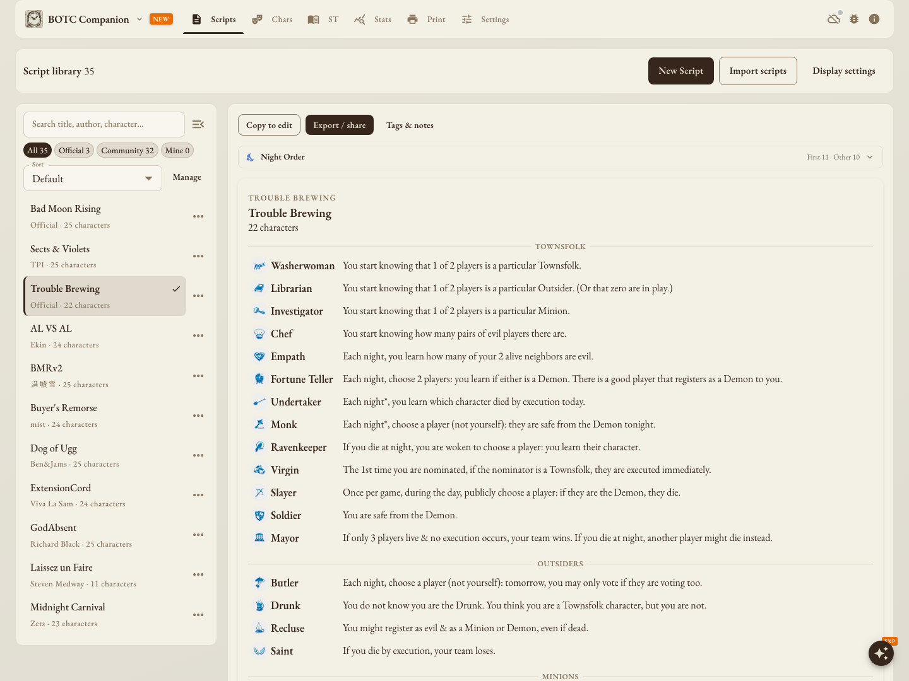
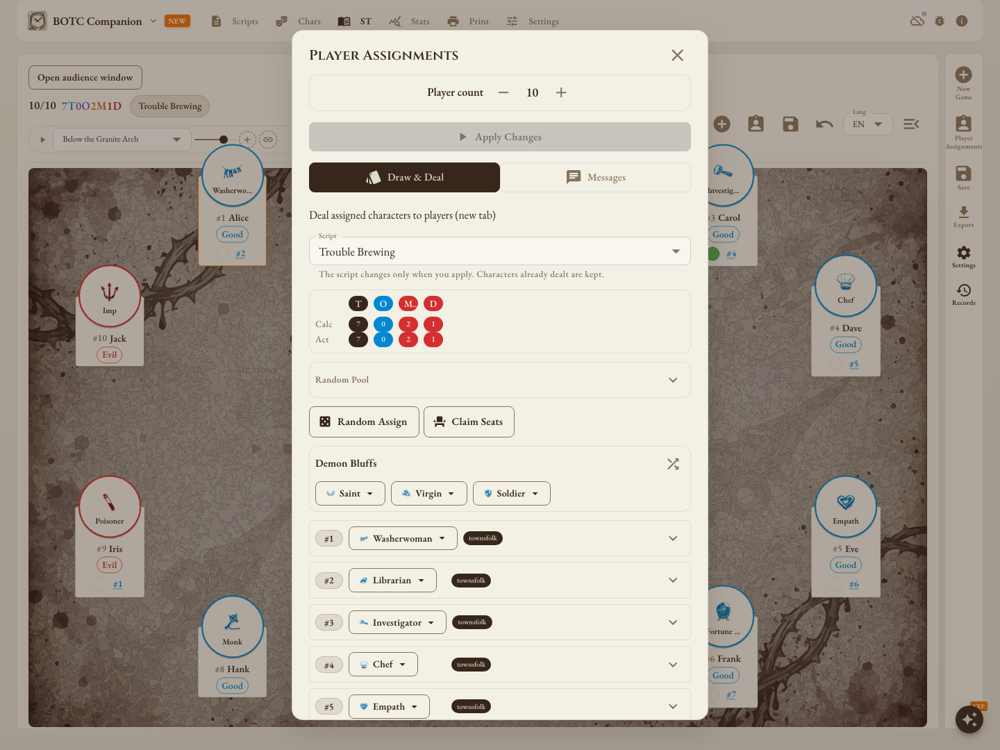
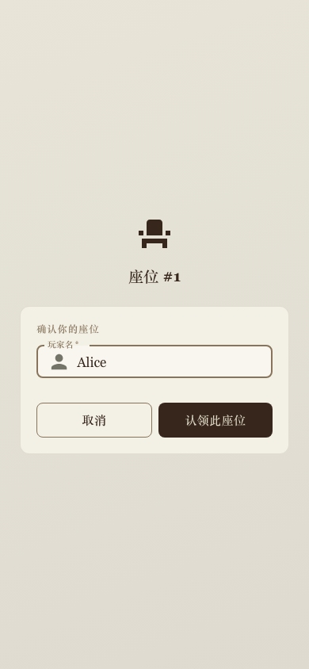
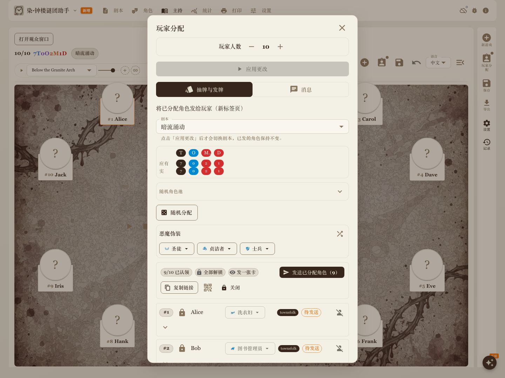
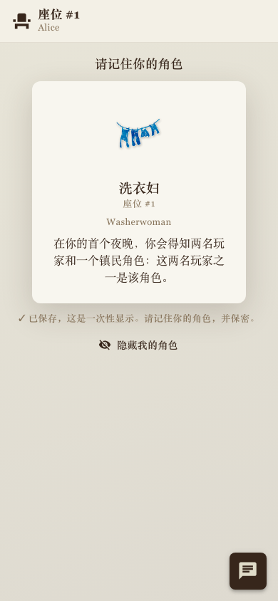
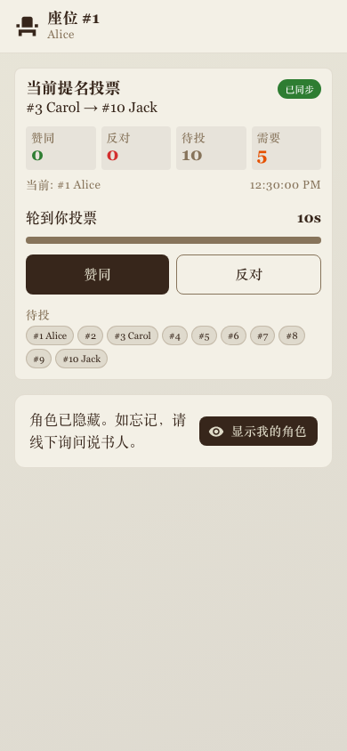
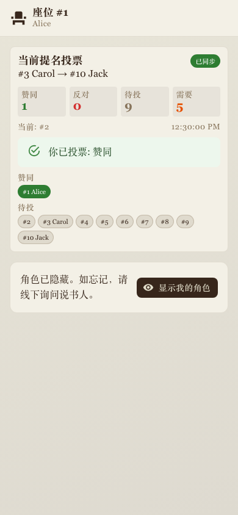

# BOTC Companion 操作手册

这份手册按一场游戏的流程介绍常用操作。第一次使用可以从「开始第一局」读起；只想调整显示或备份数据，直接查看「设置」。

[返回产品介绍](../README.md) · [打开应用](https://apps.xpandi.top/botc-script-editor/) · [更新日志](CHANGELOG.md)

## 目录

- [开始第一局](#quick-start)
- [剧本与角色](#library)
- [玩家分配与手机领取身份](#assignments)
- [玩家手机投票：实验功能](#player-voting)
- [现场主持](#hosting)
- [观众窗口](#audience)
- [保存记录与复盘](#records)
- [打印角色标记](#print)
- [设置：显示、声音、备份与同步](#settings)
- [AI 聊天助手：实验功能](#ai)
- [离线使用与常见问题](#faq)

## 开始第一局

1. 打开「剧本」，浏览内置剧本，或导入自己的剧本 JSON 文件。
2. 进入「主持助手」，创建新游戏，确认本局剧本和人数，填写玩家姓名。
3. 在「玩家分配」中安排角色，检查恶魔伪装及其他开局配置，然后开始游戏。
4. 根据实际进度切换夜晚、私聊、公开讨论和提名阶段，记录行动及投票。
5. 游戏结束后保存记录，填写结果与需要的评分，再到统计页面复盘。

电脑上通过顶部导航切换页面，手机上使用底部导航。部分按钮在手机上会使用较短的名称，例如「角色」入口可以打开玩家分配面板。

## 剧本与角色

### 选择、导入和编辑剧本

- 在「剧本」页面搜索标题、作者或角色，也可以按分类浏览。
- 选中剧本后查看角色名单和夜间顺序；通过导入入口载入标准格式的剧本 JSON。
- 需要修改内置剧本时，使用「复制编辑」建立自己的版本。
- 导出与分享入口用于保存或分享剧本；标签和备注方便整理自己的剧本库。

剧本库里正在浏览的剧本与正在主持的对局分开管理。开始新游戏时，仍需确认该局选择的剧本。

### 查阅角色资料

在角色页面按阵营、版本或关键词筛选，打开角色详情查看能力说明、相克规则和修订记录。剧本可以指定使用某个能力版本，展示和打印时会采用该版本。

内置的《奥德赛 Odyssey》角色包目前以中文资料为主，翻译和规则支持范围见[角色包说明](ODYSSEY.md)。

## 玩家分配与手机领取身份

### 安排角色

1. 在主持界面打开「玩家分配」（手机上可通过「角色」入口打开）。
2. 确认剧本，为各座位选择角色。需要随机分配时，可以先限定角色池。
3. 根据需要设置玩家看到的身份、座位备注和恶魔伪装。
4. 查看角色数量与开局配置提醒，确认后应用修改或开始新游戏。

**当前对局中，剧本、角色、玩家看到的身份、座位备注和恶魔伪装的修改，点击「应用更改」后才生效。** 直接关闭面板不会保留这些未应用的修改。切换剧本会保留已经分配的角色；请检查它们是否适合新剧本。切换时会清空之前的随机角色池限制。

这套暂存规则仅针对上述项目。增减人数、在线座位管理、发牌和发送消息等操作有各自的即时效果，不要将关闭面板视为撤销所有操作。

### 让玩家用手机入座

1. 在玩家分配面板发起入座，分享链接或二维码。
2. 玩家打开链接，选择空座位并填写姓名。
3. 说书人在座位列表中核对玩家，安排好身份后发送。
4. 玩家在自己的页面查看收到的身份；需要沟通时，通过消息入口联系说书人。

<table>
<tr><th width="50%">① 选择空座位</th><th width="50%">② 填写姓名并确认</th></tr>
<tr>
<td align="center"></td>
<td align="center"></td>
</tr>
</table>

### 说书人发放角色

玩家认领后，座位列表会显示姓名和「待发送」状态。核对座位与角色，完成需要的修改后点击「应用更改」，再点击「发送已分配角色」。**应用配置与发送给玩家是两个操作**；发送不会重新随机角色。

角色送达后默认隐藏，玩家点击「显示我的角色」才会打开身份卡，看完可以再隐藏。

*本节及下方投票截图使用真实界面和本地模拟会话，所有姓名与对局均为演示数据；不代表已验证线上服务的连接情况。*

入座、领取身份和消息需要联网。自行部署时，需要配置 Firebase 及相应访问规则；部署说明见[开发文档](DEVELOPMENT.md)。截图中的演示数据不会创建真实的在线会话。

### 私信和通知

在玩家分配面板的消息页中，可以给某个座位发消息，也可以向所有玩家发送通知。发送前确认接收对象，避免把只应告知个别玩家的信息发给全场。

## 玩家手机投票：实验功能

联动投票已开放试用，仍在调整。需要有效的在线入座会话，玩家使用自己认领座位的页面参与。

1. 说书人在提名面板选好提名者与被提名者，发起联动投票。
2. 玩家页面显示本次提名、当前投票者、票数与倒计时；新提名开始时，打开的角色卡会自动隐藏。
3. 轮到自己的座位时，点击「赞同」或「反对」。不是自己的轮次时等待提示，不要替其他玩家操作。
4. 提交后检查「你已投票」提示，并由说书人核对投票进度和最终结果。

<table>
<tr><th width="50%">① 轮到自己，点击投票</th><th width="50%">② 查看提交结果</th></tr>
<tr>
<td align="center"></td>
<td align="center"></td>
</tr>
</table>

如果页面没有更新或提示连接异常，先告知说书人，由说书人核对现场票型；不要把尚未确认提交成功的点击当作已记票。欢迎反馈卡住的步骤、设备与浏览器信息。

## 现场主持

### 夜间行动

在夜晚阶段打开角色显示与夜序显示，按顺序处理行动。点击座位查看或编辑该玩家的信息，记录行动、设置标记，以及调整存活和投票状态。

角色显示与公开展示是不同的功能。需要给玩家看屏幕时，使用独立观众窗口；不要直接共享包含身份和说书人备注的主持界面。

### 阶段与计时

按本局节奏切换夜晚、私聊、公开讨论和提名。使用计时器控制讨论与发言时间。阶段的默认时长、提示音和背景音乐可以在主持界面的设置中调整，详见[主持设置](#host-settings)。

### 提名、投票与日志

进入提名阶段后，在提名面板中选择提名者、被提名者并记录投票。完成后检查票数与结果。游戏日志用于回看提名、行动和事件，可按类型及可见范围筛选。

### 无声沟通

通过日期与阶段控制附近的沟通板入口，使用大字文本、常用短语或手绘向玩家传递信息。适合夜间告知身份、选择目标或补充说明。

## 观众窗口

1. 在主持界面点击「打开观众窗口」。如果浏览器拦截弹窗，允许本站弹窗后重试。
2. 将新窗口移到扩展屏或投影；在线游戏时，只共享这个窗口。
3. 在原主持窗口继续操作，观众画面会同步更新公开状态、阶段、倒计时与提名记录。
4. 结束展示时，点击「结束演示」或关闭观众窗口。

观众窗口不会展示非旅行者的身份、阵营、说书人标记、私密备注、私密行动或恶魔伪装。它在主持人的同一台设备上运行，不是供其他设备访问的远程观众链接。音频由主持窗口播放。

详细范围与已知限制见[观众窗口说明](PRESENTER-MODE.md)。

## 保存记录与复盘

- 游戏进行中可以保存当前进度；同一局的进度保存会更新对应记录。
- 游戏结束后保存结果，并按需要填写评分。
- 在统计页面切换概览、剧本、玩家、角色和记录，结合筛选条件查看历史对局。
- 需要迁移或分享对局时，使用主持界面或统计页面的记录导出功能。

胜率取决于已记录的结果，未填写的评分不会按零分计算。场次较少时，统计更适合用于回顾自己的游戏经历，不能据此判断剧本一定平衡或不平衡。

## 打印角色标记

1. 打开「打印工坊」，选择剧本和需要打印的角色。
2. 选择圆形、六边形、方形或矩形，调整尺寸、间距及名称和能力的显示方式。
3. 检查排版预览，确认内容和所用能力版本。
4. 使用打印或导出 PDF 功能。实体打印时检查打印机缩放设置，以免实际尺寸与预设不一致。

## 设置：显示、声音、备份与同步

### 全局显示设置

从主导航进入「设置」。建议先调整语言和界面大小，再选择字体，用页面中的预览检查阅读效果。

| 设置 | 用途 |
| --- | --- |
| 语言 | 切换中文或 English |
| 主题 | 选择浅色、深色，或跟随系统 |
| 界面大小 | 一起调整文字、间距与控件大小，适合小屏或远距离阅读 |
| 英文字体 | 分别选择正文与标题字体 |
| 中文字体 | 调整中文正文和标题使用的字体 |
| 字体预览 | 查看所选字体的实际效果 |

显示偏好保存在当前设备上。

### 主持设置

主持界面内的设置与全局显示设置分开。这里主要调整阶段计时、提示音及默认背景音乐。说书人配置面板还可以填写说书人姓名、选择传奇角色或规则角色，并记录本局自定义规则。

计时设置用于配置默认值；当前阶段的计时状态请以主持界面显示为准。上传的本地音频使用临时地址，刷新后可能需要重新选择文件。

### 备份与恢复

「设置」中的备份导出包括自定义剧本、自定义角色、能力修订覆盖和剧本标签等元数据。**它不是整台设备的完整备份，也不包含对局存档；对局记录需要单独导出。**

导入时，先选择 JSON 备份文件，再选择方式：

- **合并**：剧本和自定义角色按标识去重，重复项目保留本机版本；能力修订覆盖和剧本元数据出现相同标识时，则采用导入文件中的内容。
- **替换**：用文件中包含的数据类别替换本机对应内容。操作前先导出一份现有数据。

导入成功后按界面提示刷新页面。备份不包含 API Key、登录凭据或在线发牌会话令牌。完整数据范围见[存储说明](STORAGE.md)。

### Google Drive 同步

在设置的 Google Drive 同步区域连接账号，按提示完成授权。连接后可以使用「立即同步」，并查看最后同步时间和错误信息。

是否能够直接连接取决于当前版本的部署配置。自行部署时可能需要先配置 Google 授权信息；这不是普通玩家开始游戏的必需步骤。

### 高级连接

部分部署会显示 API 接入设置，供外部工具或自动化连接使用。日常选剧本和主持游戏无需配置这一项。

## AI 聊天助手：实验功能

**状态：已开放试用，仍在调整。** 回答质量、可支持的问题范围和交互可能变化。欢迎测试，但规则争议和正式裁定仍应由说书人结合规则资料判断。

### 怎么试用

1. 点击页面上的 AI 助手入口，打开聊天面板。
2. 先试问一个具体问题，例如某个角色的能力、某组相克关系，或当前剧本有哪些配置需要检查。
3. 需要切换回答方式时，打开助手自己的设置。
4. 核对回答与引用资料；发现问题时，通过[问题反馈](https://github.com/xpandi-top/botc-script-editor/issues)提供复现信息。

### 选择回答方式

| 模式 | 使用条件与说明 |
| --- | --- |
| 在线服务 | 当前部署需提供该服务，并保持联网；问题、近期对话和相关页面数据会发送给服务端 |
| 本地模式 | 可从本地资料和规则程序查询部分信息；如需在本机生成解释，需设备支持 WebGPU，并先下载 WebLLM 模型 |
| 自带 Key | 选择服务商和模型，填写自己的 API Key；使用自己的账号额度，Key 保存在本机浏览器中 |

本地资料查询不等于所有问题都能离线回答。模型、已缓存资料和设备能力都会影响可用范围。

### 欢迎反馈什么

请提供提问原文、实际回答、预期结果、所用模式及设备或浏览器信息；可以附上相关剧本或角色名称。不要在反馈中附带 API Key、登录凭据或其他玩家的私密信息。

## 离线使用与常见问题

### 没有网络还能用吗？

应用支持安装为 PWA。首次联网打开并完成缓存后，可以离线使用已缓存的内容；第一次打开、尚未缓存的资料以及模型下载仍需要网络。在线入座、领取身份、消息、云同步和在线 AI 不能离线使用。

### 改了剧本，当前对局为什么没有变化？

在玩家分配面板中选择剧本后，需要点击「应用更改」。如果只是浏览剧本库，也不会自动改变正在主持的对局。

### 发现角色文字、翻译或某个功能有问题？

点旁边的小旗子按钮就能直接反馈：角色详情、剧本单里的角色弹窗、剧本工具栏、主持时的座位弹窗和能力弹窗、设置的每个分区标题、统计的分类标签旁和记录编辑弹窗、打印工坊和剧本打印预览的顶栏都有；其他地方用页面右上角的虫子按钮（手机主持界面在右侧菜单底部）。选好问题类型和哪一部分，写一句说明即可；翻译或文字问题可以填上正确内容。先选中有问题的文字再点旗子，会把这段文字一起带上。反馈会附带此处显示的内容、当前页面、版本号和最近的报错，不含玩家名、笔记或密钥；离线时会先保存，联网后自动提交。

### 换设备后数据为什么没跟过来？

本地数据不会自动出现在另一台设备上。请使用相应的导出与导入功能，或在已配置的版本中使用云同步；迁移前核对[备份范围](#settings)，单独保存需要的对局记录。

### 扫码入座或 AI 服务无法使用？

先检查网络，再确认当前部署是否启用了相应服务。自行部署者可查看[开发文档](DEVELOPMENT.md)与 [Worker 文档](../worker/README.md)。AI 助手仍属实验功能，遇到异常欢迎反馈。
